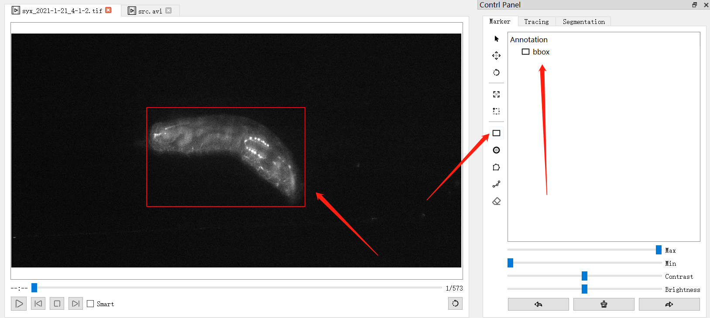
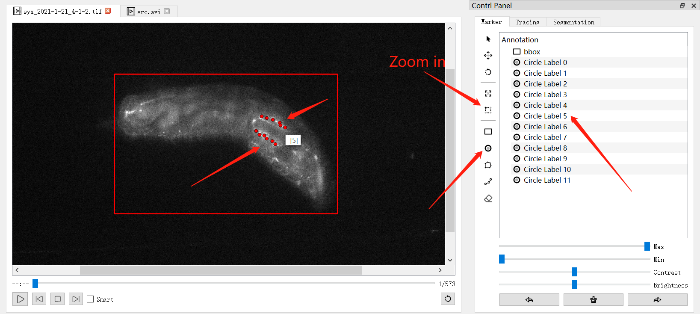

# RouRan

A transfer learning based toolbox to simultaneously track the continuously changing body posture and activity of neurons.

## Usage

1. Step 1: Draw a rectangle on the frame.

    

1. Step 2: Draw landmark annotation on the frame.

    

1. Step 3: Waiting fine-tuning finish and fetch the results.
